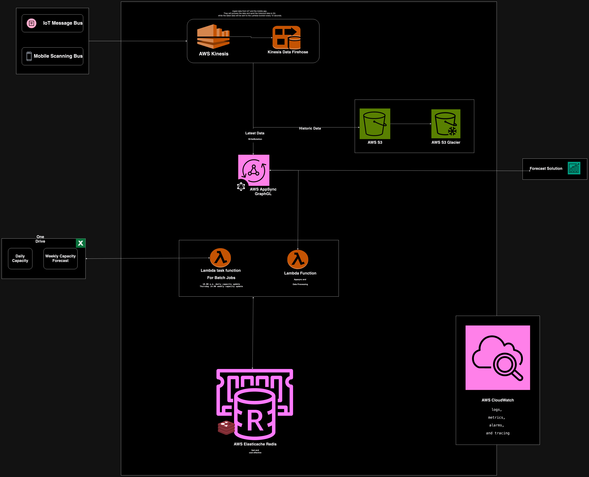

# Logistics Serverless IT platform
Simple Logistics Serverless IT platform for managing logistics operations,  tracking shipments and forecasting.

## Table of Contents


### Minimum Requirements:
- [A run-down on the design highlighting the different components](#Design-Rundown)
- [Explain why and how it scales under load, and what ‘bottlenecks’ or limitations still exist](#explain-why-and-how-it-scales-under-load-and-what-bottlenecks-or-limitations-still-exist)
- [The code for one of the backend solutions (can be Lambda) in your solution. Use a language that you see fit](#code-solution-documentation)
- [Extras](#extras)

### Design Rundown 
The Logistics Serverless IT platform is designed to be a serverless, scalable, and cost-effective solution. 



#### AWS Kinesis and Firehose
The platform uses AWS Kinesis and Firehose to ingest and process data from the IoT Message Bus and mobile scanner bus. Kinesis will ingest and process real-time data streams to Firehose every 10 seconds, and Firehose will (optionally transform) processed the data to S3 as historic storage and send the only latest data to the The Ketenplanning platform Lambda.

#### AWS S3
S3 to store and manage the historic data from the IoT Message Bus and mobile scanner bus. Which allow us to store data cost effectively, configure glacier for old file and less accessed data and also the abily to add analytics and data viewing.

#### AWS AppSync
AppSync provide us a managed GraphQL API for the IoT and mobile bus data from firehose and providing graphql endpoint for the forecast team to pull and push data and also api endpoint for planning and operator frontend. appsync allows us to easily scale and add addition of new connection features. 

#### AWS Lambda
We use Lambda to process and save/update the IoT location, Mobile Scanner, Daily capacity, weekly capacity and forecast data to our redis database. The platform uses Lambda to run code in response to events such as Kinesis Firehose data, task scheduling to pull in and process excel capacity data and recieve/send data to through appsync. 

#### AWS Elasticache (Redis)
The platform uses AWS Elasticache to provide a managed Redis datastore for the real-time data cost effectively with high-performance, and low-latency. 

#### AWS CloudWatch
The platform uses AWS CloudWatch to monitor and log the system behavior. The platform uses CloudWatch to monitor the system metrics, set alarms, and log the system and application behavior.

### Explain why and how it scales under load, and what ‘bottlenecks’ or limitations still exist
The platform is designed to be serverless and scalable. The platform leverages AWS Kinesis and firehose to efficiently process real time data from IoT and Mobile Scanner to provide a scalable, cost-effective, and highly available solution. 
The platform leverage lambda for its ease of use, ability to scale automatically under load and eliminating the need for complex infrastructure management.
Security was not considered in this design, but it is important to note that the platform can be secured using AWS IAM, Cognito, and api security features in appsync to provide a secure and compliant solution.


### Code Solution Documentation:

#### Installation

```sh
npm install
```

#### Running the app

```sh
# development
npm run build

# Run Lambda event locally for Add Location
npm run lambda:addLocation

# Run Lambda event locally for Add Scanning 
npm run lambda:addScanning

# Run Lambda event locally for Get Observations data 
npm run lambda:getObservations

# Run Lambda event locally for Load Daily capacity
npm run lambda:loadDailyCapacity

# Run Lambda event locally for Load Weekly capacity
npm run lambda:loadWeeklyCapacity

# Run Lambda event locally for Get Depot data
npm run lambda:getDepotData
```

#### Test

```sh
# unit/integration tests
npm run test
```
